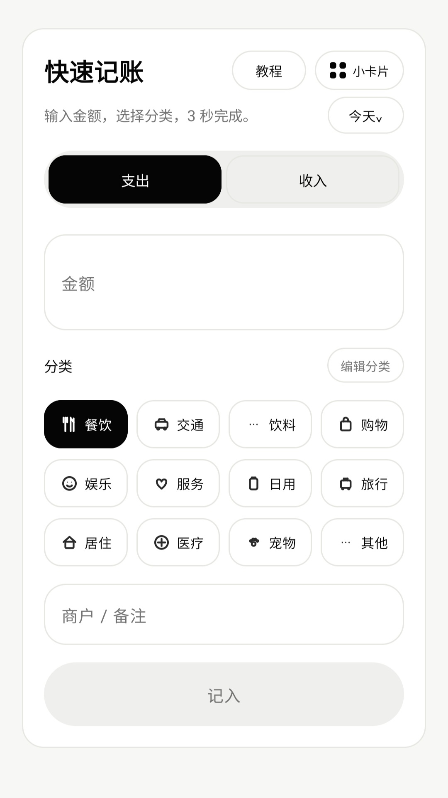
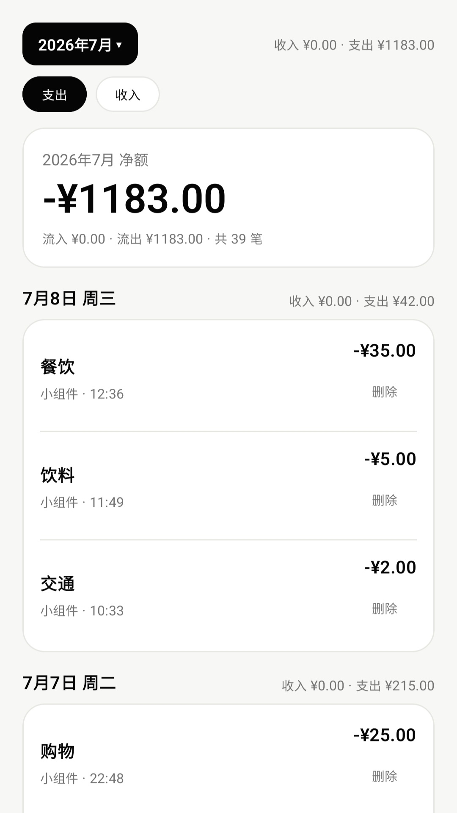
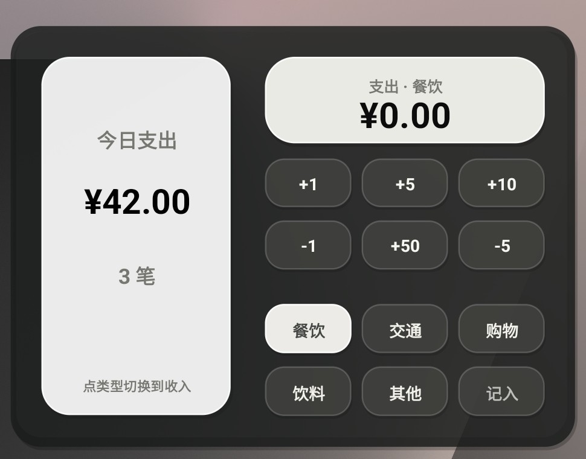
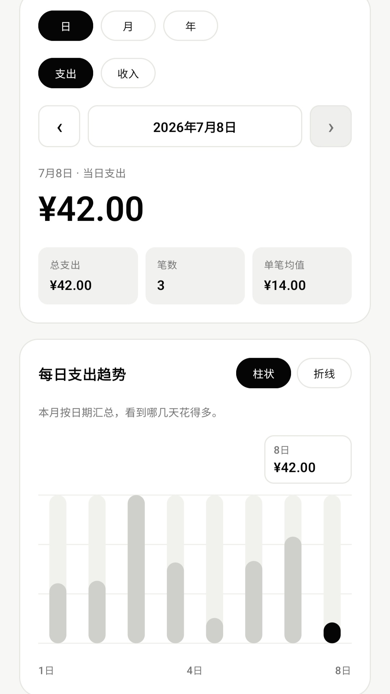
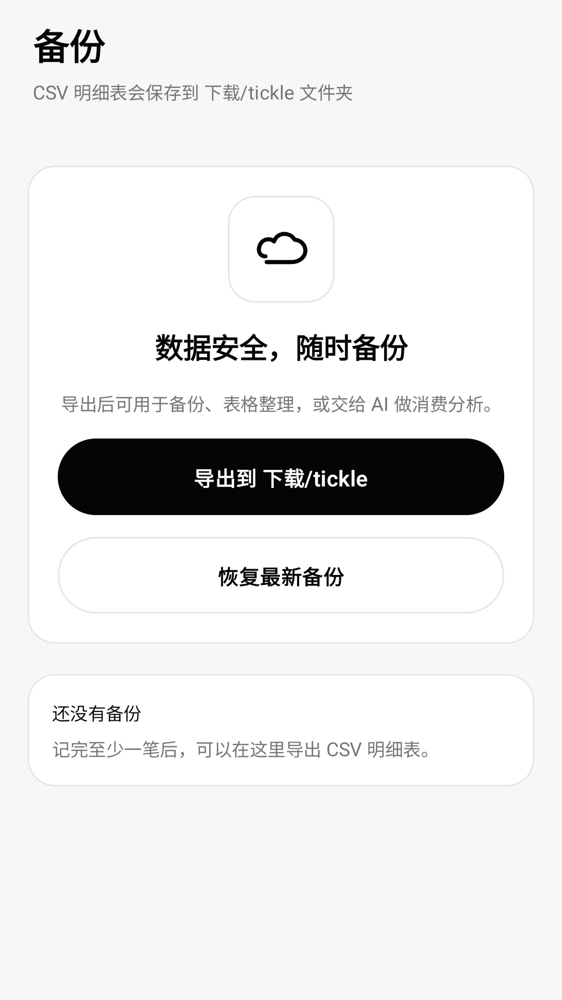
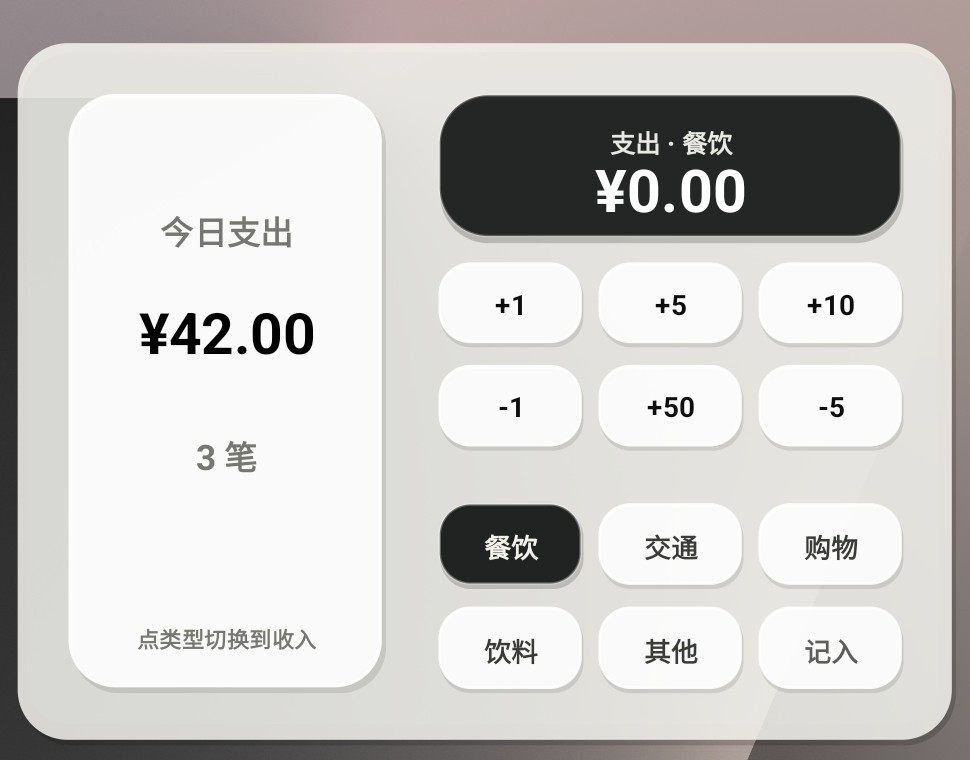

<p align="center">
  
</p>

<h1 align="center">Tickle 轻记</h1>

<p align="center">3 秒记一笔的小账本。</p>

<p align="center">
  <a href="https://github.com/wangdachui886/tickle-3s-/raw/main/releases/tickle.apk">下载 APK</a>
</p>

<p align="center">
  
  
  
</p>


Tickle 轻记是一个小而克制的 Android 记账工具。不联网，不登录，不上传账本。你只需要在 App 或桌面小组件上点几下，就能记下一笔日常消费。（强烈推荐桌面小组件记账！）

它不是又大又全的记账 App，而是更少打扰的记账 App。所以需要各种自动化/ai智能体的朋友们就勿下。

> 目前还是中期版本，但足够稳定，适合试用和小范围测试。截图先放一版，重新画过的教程图后面再补。

## 先下载试试

[下载 APK：tickle.apk](https://github.com/wangdachui886/tickle-3s-/raw/main/releases/tickle.apk)

这个包是 debug 体验版，不是应用商店的正式签名包。Android 安装时可能会提示「未知来源」或风险提醒，这是因为还没有上架商店。

当前包名：`com.lightledger.app`

安装包现在 10 MB 左右，没有后端、账号系统和统计 SDK。打开就是记账。

## 看一眼界面

下面这组截图来自三星 Fold7。先把真实界面放出来，后面再补更规整的教程图。

<p>
  
  
  
  
</p>

桌面小组件是我最想做好的部分。它适合那些懒得打开 App、但又想顺手记一笔的人。

<p>
  
  
</p>

## 为什么更轻，也更安心？

Tickle 轻记默认不联网，不需要登录账号，也不会把记账数据上传到服务器。

它不绑定银行卡，不读取短信、相册、通讯录和定位，也不依赖通知权限来识别消费记录。所有记录默认保存在手机本地；如果你想备份，可以自己导出 CSV。

这也意味着它做不到自动同步、多设备协作和复杂资产管理。换来的好处是：体积更小、权限更少、边界更清楚。

## 适合谁？

适合想手动记账，但不想被复杂功能打扰的人。

比如你只是想记下：

- 刚刚吃饭花了多少钱
- 打车花了多少钱
- 今天有没有一笔收入
- 每天大概花在哪些分类上

如果你需要的是自动同步、多账户资产管理、银行卡分析、预算系统，Tickle 轻记可能不是最适合的选择。它现在只想把一件小事做好：记一笔，尽量快，尽量少打扰。

## 现在能做什么

- 在 App 里快速记一笔支出或收入。
- 选择历史日期，补记前几天的账。
- 管理常用分类，也可以加自己的分类。
- 在流水页按日期看记录，支持编辑和删除。
- 在统计页看日、月、年的支出或收入。
- 导出 CSV，也可以从最近一次导出的 CSV 恢复。
- 添加桌面小组件，直接在桌面上记账。

小组件现在有 6 个版本：

- 4x2 深色 / 浅色
- 4x3 深色 / 浅色
- 4x4 深色 / 浅色

小组件支持金额按钮、分类按钮、支出/收入切换、保存、撤销，也会在跨天后刷新当天汇总。

## 数据和备份

数据默认留在手机本地。CSV 导出和恢复都由用户自己点，文件放在：

```text
Download/tickle
```

CSV 字段现在很少：`date`、`direction`、`amount`、`unit`、`type`、`note`。详细说明在 [docs/DATA_EXPORT.md](docs/DATA_EXPORT.md)。

## 开发

用 Android Studio 打开项目根目录即可。

这台机器上的本地开发环境示例：

```powershell
$env:JAVA_HOME='D:\Andriod Studio\jbr'
$env:PATH="$env:JAVA_HOME\bin;$env:PATH"
```

构建普通版：

```powershell
.\gradlew.bat :app:assembleMainlineDebug
```

构建朋友测试版，不覆盖普通版：

```powershell
.\gradlew.bat :app:assembleFriendsDebug
```

运行单元测试：

```powershell
.\gradlew.bat :app:testMainlineDebugUnitTest
.\gradlew.bat :app:testFriendsDebugUnitTest
```

更多结构说明见 [docs/PROJECT_STRUCTURE.md](docs/PROJECT_STRUCTURE.md)，发布前检查见 [docs/RELEASE_CHECKLIST.md](docs/RELEASE_CHECKLIST.md)。

## 版本

- `mainline`：`com.lightledger.app`，应用名 `tickle`
- `friends`：`com.lightledger.app.friends`，应用名 `tickle beta`

如果以后要上架商店，还需要重新做签名包、版本号、截图和隐私文案。

## 目录说明

- `app/`：Android 源码。
- `docs/`：数据格式、项目结构、发布检查清单。
- `releases/`：公开下载用 APK。
- `dist/`：本地构建出的测试包，不作为源码维护。
- `artifacts/`：本地截图、UI dump、旧实验材料，不进公开仓库。

## License

Apache License 2.0.
